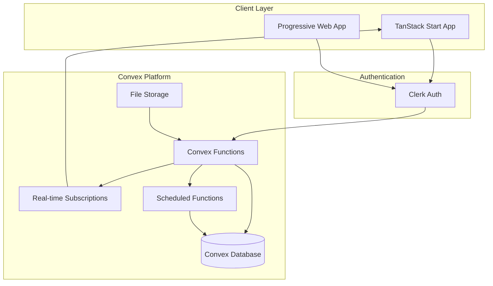

# Product Requirements Document (PRD)
# Caddy - NDIS Service Provider Management Platform

**Version:** 1.0  
**Date:** 2025-08-09  
**Author:** John (Product Manager)  
**Status:** Draft

---

## Table of Contents

1. [Executive Summary](#executive-summary)
2. [Product Overview](#product-overview)
3. [User Roles & Permissions](#user-roles--permissions)
4. [Feature Specifications](#feature-specifications)
5. [User Stories & Acceptance Criteria](#user-stories--acceptance-criteria)
6. [Technical Architecture](#technical-architecture)
7. [Data Model](#data-model)
8. [API Specifications](#api-specifications)
9. [CSV Import/Export Requirements](#csv-importexport-requirements)
10. [Pricing Strategy](#pricing-strategy)
11. [NDIS Compliance Checklist](#ndis-compliance-checklist)
12. [Security Requirements](#security-requirements)
13. [Performance Requirements](#performance-requirements)
14. [Success Metrics](#success-metrics)
15. [Release Plan](#release-plan)
16. [Appendices](#appendices)

---

## Executive Summary

Caddy is a comprehensive NDIS service provider management platform designed to streamline operations for disability support organizations. The platform addresses critical operational challenges by providing integrated tools for participant management, real-time budget tracking, service delivery logging, and automated NDIS claiming.

### Key Value Propositions
- **60% reduction in administrative burden** through smart defaults and automation
- **Zero revenue leakage** with comprehensive claims tracking and predictive alerts
- **100% compliance accuracy** through built-in NDIS business rules and audit trails
- **Immediate ROI** with simple, focused features that deliver value from day one

### MVP Focus
The MVP targets small to medium NDIS service providers (20-100 participants) with a web-first responsive design that prioritizes:
- Daily Huddle Dashboard (must-have)
- Participant management with CSV import
- Real-time budget tracking
- Service delivery logging
- Claims generation
- Message board for team communication
- Compliance tracking with audit trails

---

## Product Overview

### Vision Statement
To become the essential operational backbone for NDIS service providers, enabling them to focus on participant care rather than administration.

### Mission
Deliver a radically simple, immediately valuable platform that prevents revenue loss and ensures compliance for NDIS service providers.

### Target Market
- **Primary:** Small to medium NDIS service providers (20-100 participants)
- **Geographic:** Sydney/NSW and ACT initially
- **Expansion:** National rollout within 12 months

### Competitive Positioning
Unlike complex enterprise solutions (Lumary) or generic practice management tools, Caddy offers:
- **Focused simplicity:** Only features that prevent revenue loss or compliance breaches
- **Competitive pricing:** $99-299/month vs. $500-2000/month competitors
- **Rapid implementation:** 2-hour onboarding vs. 3-6 months
- **NDIS-native design:** Built specifically for NDIS workflows

---

## User Roles & Permissions

### Authentication Provider
**Clerk** will be used for authentication with the following implementation:

### Platform Roles

#### Platform Admin (Super Admin)
- **Scope:** Cross-organization management
- **Permissions:**
  - Manage organization accounts
  - Access platform analytics
  - Configure platform-wide settings
  - Manage billing and subscriptions
  - Support ticket access

### Organization Roles (Hierarchical)

#### 1. Organization Admin (Highest)
**Inherits:** All lower role permissions  
**Unique Permissions:**
- User management (create, update, archive users)
- Organization settings configuration
- Billing and subscription management
- Access all participant data
- Configure role permissions
- Export all data
- Archive/restore participants and employees
- Message board administration

#### 2. Finance Officer
**Inherits:** Support Coordinator + Support Worker permissions  
**Unique Permissions:**
- Approve/reject timesheets
- Generate and submit claims
- Access financial reports
- View all participant budgets
- Process invoices
- Export financial data
- Bulk claim operations

#### 3. Support Coordinator
**Inherits:** Support Worker permissions  
**Unique Permissions:**
- Manage participant profiles
- Assign support workers to participants
- View all assigned participant data
- Create and modify service bookings
- Access compliance reports
- Team coordination features
- Delegate access during leave

#### 4. Support Worker (Lowest)
**Base Permissions:**
- View assigned participants only
- Log service delivery
- Create shift notes
- View participant budgets (assigned only)
- Upload incident reports
- View message board
- Update own profile

### Clerk Implementation Details

```typescript
// User metadata structure in Clerk
interface ClerkUserMetadata {
  organizationId: string;
  role: 'platform_admin' | 'org_admin' | 'finance' | 'coordinator' | 'support_worker';
  permissions: string[];
  delegatedAccess?: {
    from: string;
    until: Date;
    participants: string[];
  };
}
```

### Permission Matrix

| Feature | Platform Admin | Org Admin | Finance | Coordinator | Support Worker |
|---------|---------------|-----------|---------|-------------|----------------|
| Platform Management | ✅ | ❌ | ❌ | ❌ | ❌ |
| User Management | ✅ | ✅ | ❌ | ❌ | ❌ |
| Financial Operations | ✅ | ✅ | ✅ | ❌ | ❌ |
| Participant Management | ✅ | ✅ | ✅ | ✅ | ❌ |
| Service Delivery | ✅ | ✅ | ✅ | ✅ | ✅ |
| View Assigned Only | ❌ | ❌ | ❌ | ❌ | ✅ |

---

## Feature Specifications

### 1. Daily Huddle Dashboard (MUST HAVE)

**Description:** Single-screen operational command center showing everything needed for the day.

**Components:**
- Today's shifts and assignments
- Critical alerts (budget warnings, missing documentation)
- Participant birthdays and important dates
- Compliance score overview
- Quick actions panel
- Team message board preview

**Technical Requirements:**
- Load time < 2 seconds
- Auto-refresh every 30 seconds
- Mobile responsive
- Customizable widgets

### 2. Participant Management

**Description:** Comprehensive participant profile management with NDIS plan tracking.

**Features:**
- Profile creation and editing
- NDIS number and plan details
- Contact information
- Support team assignment
- Document storage
- Plan start/end date tracking
- Archive functionality (7-year retention)

**CSV Import:**
- Support Xero contact format
- Bulk participant import
- Field mapping interface
- Validation and error reporting

### 3. Budget Tracking with Traffic Lights

**Description:** Real-time budget visibility with visual indicators.

**Features:**
- Category-wise budget breakdown
- Traffic light system:
  - Green: >40% remaining
  - Amber: 20-40% remaining
  - Red: <20% remaining
- Spending trends graph
- Predictive depletion dates
- Export to PDF/Excel

### 4. Service Delivery Logging

**Description:** Quick and compliant service recording.

**Features:**
- Smart defaults based on patterns
- Time and duration tracking
- Support category selection
- NDIS price guide integration
- Batch entry for recurring services
- Note templates
- Photo attachments

### 5. Claims Generation

**Description:** Automated claim preparation and submission.

**Features:**
- Date range selection
- Claim value prediction
- Missing claims alerts
- NDIS-compliant CSV export
- Pre-submission validation
- Claim history tracking
- Bulk operations

### 6. Message Board

**Description:** Team communication hub.

**Features:**
- Admin post creation
- Read receipts tracking
- Pin important messages
- Category tags (urgent, FYI, policy)
- Search functionality
- Email notifications (optional)
- Archive old messages

### 7. Compliance Tracking

**Description:** Automated compliance monitoring.

**Features:**
- Document expiry tracking
- Audit trail (all actions logged)
- Soft delete with 7-year retention
- Version history for notes
- Compliance checklist per participant
- NDIS Quality & Safeguards alignment

---

## User Stories & Acceptance Criteria

### Epic 1: Participant Onboarding

#### User Story 1.1: CSV Import
**As an** Organization Admin  
**I want to** import participants from a CSV file  
**So that** I can quickly onboard multiple participants without manual entry

**Acceptance Criteria:**
- Support Xero contact CSV format
- Map fields to participant profile
- Validate NDIS numbers
- Show import progress
- Report errors with line numbers
- Allow partial imports
- Support up to 1000 records

#### User Story 1.2: Manual Participant Creation
**As a** Support Coordinator  
**I want to** manually create participant profiles  
**So that** I can add new participants immediately

**Acceptance Criteria:**
- Required fields: Name, NDIS number, plan dates
- Optional fields: Contact, address, notes
- NDIS number validation
- Duplicate detection
- Save as draft option
- Confirmation on creation

### Epic 2: Service Delivery

#### User Story 2.1: Quick Shift Logging
**As a** Support Worker  
**I want to** log my shift in under 3 minutes  
**So that** I can focus on participant care

**Acceptance Criteria:**
- Pre-filled defaults from previous shifts
- One-click "same as yesterday"
- Auto-calculate duration
- Template notes selection
- Mobile responsive
- Offline queue capability

#### User Story 2.2: Budget Visibility
**As a** Support Coordinator  
**I want to** see budget status at a glance  
**So that** I can prevent overspending

**Acceptance Criteria:**
- Traffic light indicators
- Real-time updates
- Category breakdown
- Remaining amounts
- Days until plan end
- Export functionality

### Epic 3: Financial Management

#### User Story 3.1: Claims Processing
**As a** Finance Officer  
**I want to** generate claims with confidence  
**So that** we don't miss revenue

**Acceptance Criteria:**
- Select date range
- Preview claim value
- Validation checks
- NDIS format export
- Claim history
- Resubmission capability

#### User Story 3.2: Revenue Prediction
**As an** Organization Admin  
**I want to** see predicted claim values  
**So that** I can manage cash flow

**Acceptance Criteria:**
- Running total as services logged
- "Unclaimed value" alerts
- Monthly projections
- Category breakdown
- Export to Excel

### Epic 4: Team Communication

#### User Story 4.1: Team Announcements
**As an** Organization Admin  
**I want to** post messages to all staff  
**So that** everyone stays informed

**Acceptance Criteria:**
- Rich text editor
- Category tags
- Pin important messages
- Schedule posts
- Read receipt tracking
- Search functionality

#### User Story 4.2: Message Acknowledgment
**As a** Support Worker  
**I want to** confirm I've read important messages  
**So that** management knows I'm informed

**Acceptance Criteria:**
- One-click acknowledgment
- Unread indicator
- Push notifications (optional)
- Message history
- Filter by category

---

## Technical Architecture

### Technology Stack

#### Frontend
- **Framework:** TanStack Start (file-based routing)
- **Language:** TypeScript (end-to-end type safety)
- **Styling:** Tailwind CSS with Shadcn/ui
- **State Management:** TanStack Query + Convex real-time subscriptions
- **Forms:** TanStack Form with Zod validation
- **Tables:** TanStack Table
- **Charts:** Recharts
- **PWA:** Service Worker for offline capability

#### Backend
- **Platform:** Convex (all backend logic)
- **Database:** Convex reactive database
- **Functions:** Convex queries, mutations, and actions
- **Real-time:** Built-in reactive subscriptions
- **File Storage:** Convex file storage
- **Background Jobs:** Convex scheduled functions
- **Integrations:** Convex actions for third-party APIs

#### Authentication
- **Provider:** Clerk (integrated with Convex)
- **Session Management:** Convex Auth integration
- **MFA:** Optional TOTP via Clerk

#### Infrastructure
- **Backend Hosting:** Convex Cloud (managed)
- **Frontend Hosting:** Vercel/Netlify/Cloudflare Pages
- **CDN:** Cloudflare
- **Monitoring:** Convex dashboard + Sentry
- **Analytics:** PostHog
- **CI/CD:** GitHub Actions

### System Architecture



### Deployment Architecture

```yaml
Production Environment:
  - Convex Cloud (Backend - fully managed)
  - TanStack Start on Vercel/Netlify
  - Clerk for authentication
  - CloudFlare for CDN and DDoS protection
  - Automatic global edge distribution

Staging Environment:
  - Convex Dev deployment
  - TanStack Start preview deployments
  - Clerk staging environment
  - Same architecture as production

Development:
  - Local TanStack Start dev server
  - Convex dev deployment (cloud)
  - Clerk dev environment
  - Hot reload with real-time sync
```

---

## Data Model

### Convex Schema Definition

```typescript
// convex/schema.ts
import { defineSchema, defineTable } from "convex/server";
import { v } from "convex/values";

export default defineSchema({
  organizations: defineTable({
    name: v.string(),
    abn: v.optional(v.string()),
    contactEmail: v.string(),
    contactPhone: v.optional(v.string()),
    address: v.optional(v.object({
      street: v.string(),
      city: v.string(),
      state: v.string(),
      postcode: v.string(),
    })),
    settings: v.object({
      timezone: v.string(),
      dateFormat: v.string(),
      features: v.array(v.string()),
    }),
    subscriptionTier: v.string(),
    subscriptionEnd: v.optional(v.number()),
    deletedAt: v.optional(v.number()),
  })
    .index("by_email", ["contactEmail"])
    .index("by_subscription", ["subscriptionTier"]),

  users: defineTable({
    clerkId: v.string(),
    organizationId: v.id("organizations"),
    email: v.string(),
    firstName: v.string(),
    lastName: v.string(),
    role: v.union(
      v.literal("PLATFORM_ADMIN"),
      v.literal("ORG_ADMIN"),
      v.literal("FINANCE"),
      v.literal("COORDINATOR"),
      v.literal("SUPPORT_WORKER")
    ),
    isActive: v.boolean(),
    lastLogin: v.optional(v.number()),
    deletedAt: v.optional(v.number()),
  })
    .index("by_clerk", ["clerkId"])
    .index("by_organization", ["organizationId"])
    .index("by_email", ["email"])

  participants: defineTable({
    organizationId: v.id("organizations"),
    ndisNumber: v.string(),
    firstName: v.string(),
    lastName: v.string(),
    dateOfBirth: v.optional(v.number()),
    email: v.optional(v.string()),
    phone: v.optional(v.string()),
    address: v.optional(v.object({
      street: v.string(),
      city: v.string(),
      state: v.string(),
      postcode: v.string(),
    })),
    planStartDate: v.number(),
    planEndDate: v.number(),
    planCategories: v.array(v.object({
      name: v.string(),
      code: v.string(),
      budget: v.number(),
    })),
    totalBudget: v.number(),
    contactPerson: v.optional(v.object({
      name: v.string(),
      phone: v.string(),
      email: v.string(),
      relationship: v.string(),
    })),
    externalProviders: v.optional(v.array(v.object({
      name: v.string(),
      type: v.string(),
      organization: v.string(),
    }))),
    isActive: v.boolean(),
    archivedAt: v.optional(v.number()),
    deletedAt: v.optional(v.number()),
  })
    .index("by_organization", ["organizationId"])
    .index("by_ndis", ["ndisNumber"])
    .index("by_org_ndis", ["organizationId", "ndisNumber"])

  participantAssignments: defineTable({
    participantId: v.id("participants"),
    userId: v.id("users"),
    role: v.union(v.literal("coordinator"), v.literal("support_worker")),
    startDate: v.number(),
    endDate: v.optional(v.number()),
  })
    .index("by_participant", ["participantId"])
    .index("by_user", ["userId"])
    .index("unique_assignment", ["participantId", "userId", "role"])

  services: defineTable({
    organizationId: v.id("organizations"),
    participantId: v.id("participants"),
    userId: v.id("users"),
    serviceDate: v.number(),
    startTime: v.number(),
    endTime: v.number(),
    duration: v.number(), // minutes
    supportCategory: v.string(),
    supportItem: v.string(),
    rate: v.number(),
    totalCost: v.number(),
    notes: v.optional(v.string()),
    attachments: v.optional(v.array(v.id("_storage"))),
    status: v.union(
      v.literal("DRAFT"),
      v.literal("SUBMITTED"),
      v.literal("CLAIMED"),
      v.literal("REJECTED")
    ),
    claimId: v.optional(v.id("claims")),
    deletedAt: v.optional(v.number()),
  })
    .index("by_organization_date", ["organizationId", "serviceDate"])
    .index("by_participant", ["participantId"])
    .index("by_user", ["userId"])
    .index("by_claim", ["claimId"])

  claims: defineTable({
    organizationId: v.id("organizations"),
    claimNumber: v.string(),
    startDate: v.number(),
    endDate: v.number(),
    totalAmount: v.number(),
    status: v.union(
      v.literal("DRAFT"),
      v.literal("SUBMITTED"),
      v.literal("ACCEPTED"),
      v.literal("REJECTED"),
      v.literal("PAID")
    ),
    submittedAt: v.optional(v.number()),
    submittedBy: v.optional(v.id("users")),
    ndisResponse: v.optional(v.object({
      status: v.string(),
      message: v.string(),
      errors: v.optional(v.array(v.string())),
    })),
  })
    .index("by_organization", ["organizationId"])
    .index("by_org_number", ["organizationId", "claimNumber"])
    .index("by_status", ["organizationId", "status"])

  budgets: defineTable({
    participantId: v.id("participants"),
    category: v.string(),
    allocated: v.number(),
    spent: v.number(),
    remaining: v.number(),
    startDate: v.number(),
    endDate: v.number(),
  })
    .index("by_participant", ["participantId"])
    .index("by_participant_category", ["participantId", "category", "startDate"])

  messages: defineTable({
    organizationId: v.id("organizations"),
    authorId: v.id("users"),
    title: v.string(),
    content: v.string(),
    category: v.union(
      v.literal("URGENT"),
      v.literal("POLICY"),
      v.literal("FYI"),
      v.literal("GENERAL")
    ),
    isPinned: v.boolean(),
    publishAt: v.number(),
    expiresAt: v.optional(v.number()),
    deletedAt: v.optional(v.number()),
  })
    .index("by_organization", ["organizationId"])
    .index("by_org_pinned", ["organizationId", "isPinned"])
    .index("by_publish", ["organizationId", "publishAt"]),

  messageReads: defineTable({
    messageId: v.id("messages"),
    userId: v.id("users"),
    readAt: v.number(),
  })
    .index("by_message", ["messageId"])
    .index("by_user", ["userId"])
    .index("by_message_user", ["messageId", "userId"])

  documents: defineTable({
    participantId: v.id("participants"),
    type: v.union(
      v.literal("SERVICE_AGREEMENT"),
      v.literal("NDIS_PLAN"),
      v.literal("INCIDENT_REPORT"),
      v.literal("ASSESSMENT"),
      v.literal("OTHER")
    ),
    name: v.string(),
    storageId: v.id("_storage"),
    expiryDate: v.optional(v.number()),
    uploadedBy: v.id("users"),
    deletedAt: v.optional(v.number()),
  })
    .index("by_participant", ["participantId"])
    .index("by_type", ["type"]),

  notes: defineTable({
    participantId: v.id("participants"),
    content: v.string(),
    type: v.union(
      v.literal("SHIFT_NOTE"),
      v.literal("INCIDENT"),
      v.literal("PROGRESS"),
      v.literal("GENERAL")
    ),
    authorId: v.id("users"),
    version: v.number(),
    previousVersion: v.optional(v.id("notes")),
    deletedAt: v.optional(v.number()),
  })
    .index("by_participant", ["participantId"])
    .index("by_type", ["type"]),

  auditLogs: defineTable({
    organizationId: v.id("organizations"),
    userId: v.optional(v.id("users")),
    action: v.string(),
    entity: v.string(),
    entityId: v.string(),
    oldValue: v.optional(v.any()),
    newValue: v.optional(v.any()),
    ipAddress: v.optional(v.string()),
    userAgent: v.optional(v.string()),
    timestamp: v.number(),
  })
    .index("by_organization", ["organizationId"])
    .index("by_entity", ["entity", "entityId"])
    .index("by_user", ["userId"])
    .index("by_timestamp", ["timestamp"]),
});
```

### Real-time Subscriptions

Convex automatically provides real-time subscriptions for all data. Key patterns:

```typescript
// Real-time participant list
const participants = useQuery(api.participants.list, { 
  organizationId 
});

// Real-time budget tracking
const budget = useQuery(api.budgets.getByParticipant, { 
  participantId 
});

// Real-time message board
const messages = useQuery(api.messages.recent, { 
  organizationId,
  limit: 10 
});
```

---

## API Specifications

### Convex Functions Architecture

Convex provides three types of functions:
- **Queries**: Read-only functions with real-time subscriptions
- **Mutations**: Functions that modify data
- **Actions**: Functions that call third-party APIs or perform side effects

#### Authentication
All functions are authenticated via Clerk integration with Convex:
```typescript
// Automatic auth context in all functions
export const myFunction = mutation({
  handler: async (ctx, args) => {
    const identity = await ctx.auth.getUserIdentity();
    if (!identity) throw new Error("Unauthenticated");
    // Function logic here
  },
});
```

### Core Functions

#### Participants

```typescript
// convex/participants.ts

// Query: List participants with real-time updates
export const list = query({
  args: {
    search: v.optional(v.string()),
    active: v.optional(v.boolean()),
    planExpiring: v.optional(v.boolean()),
    limit: v.optional(v.number()),
  },
  handler: async (ctx, args) => {
    // Returns reactive list that auto-updates
    const participants = await ctx.db
      .query("participants")
      .withIndex("by_organization")
      .filter(/* search and filter logic */)
      .take(args.limit ?? 20);
    return participants;
  },
});

// Query: Get single participant
export const get = query({
  args: { id: v.id("participants") },
  handler: async (ctx, { id }) => {
    return await ctx.db.get(id);
  },
});

// Mutation: Create participant
export const create = mutation({
  args: {
    ndisNumber: v.string(),
    firstName: v.string(),
    lastName: v.string(),
    planStartDate: v.number(),
    planEndDate: v.number(),
    planCategories: v.array(v.object({...})),
    totalBudget: v.number(),
  },
  handler: async (ctx, args) => {
    const id = await ctx.db.insert("participants", args);
    return id;
  },
});

// Mutation: Update participant
export const update = mutation({
  args: {
    id: v.id("participants"),
    ...participantFields, // Partial fields
  },
  handler: async (ctx, { id, ...updates }) => {
    await ctx.db.patch(id, updates);
  },
});

// Mutation: Archive participant
export const archive = mutation({
  args: { id: v.id("participants") },
  handler: async (ctx, { id }) => {
    await ctx.db.patch(id, { 
      archivedAt: Date.now(),
      isActive: false 
    });
  },
});

// Action: Import CSV (calls external APIs)
export const importCSV = action({
  args: { fileId: v.id("_storage") },
  handler: async (ctx, { fileId }) => {
    // Process CSV file
    // Return import results
  },
});
```

#### Services

```typescript
// convex/services.ts

// Query: List services with filters
export const list = query({
  args: {
    participantId: v.optional(v.id("participants")),
    userId: v.optional(v.id("users")),
    dateFrom: v.optional(v.number()),
    dateTo: v.optional(v.number()),
    status: v.optional(v.string()),
    unclaimed: v.optional(v.boolean()),
  },
  handler: async (ctx, args) => {
    // Real-time filtered list
    let query = ctx.db.query("services");
    if (args.participantId) {
      query = query.withIndex("by_participant", q => 
        q.eq("participantId", args.participantId)
      );
    }
    return await query.collect();
  },
});

// Mutation: Create service with smart defaults
export const create = mutation({
  args: {
    participantId: v.id("participants"),
    serviceDate: v.number(),
    startTime: v.number(),
    endTime: v.number(),
    supportCategory: v.string(),
    supportItem: v.string(),
    notes: v.optional(v.string()),
  },
  handler: async (ctx, args) => {
    // Apply smart defaults from history
    const defaults = await getSmartDefaults(ctx, args.participantId);
    const service = { ...defaults, ...args };
    
    const id = await ctx.db.insert("services", service);
    
    // Update budget spent in real-time
    await updateBudgetSpent(ctx, args.participantId);
    
    return id;
  },
});

// Mutation: Bulk create services
export const bulkCreate = mutation({
  args: {
    services: v.array(v.object({/* service fields */}))
  },
  handler: async (ctx, { services }) => {
    const ids = [];
    for (const service of services) {
      ids.push(await ctx.db.insert("services", service));
    }
    return ids;
  },
});
```

#### Claims

```typescript
// convex/claims.ts

// Query: Generate claim preview with real-time totals
export const preview = query({
  args: {
    startDate: v.number(),
    endDate: v.number(),
    participantIds: v.optional(v.array(v.id("participants"))),
  },
  handler: async (ctx, args) => {
    const services = await ctx.db
      .query("services")
      .withIndex("by_organization_date")
      .filter(/* date range and participant filter */)
      .collect();
    
    // Calculate totals in real-time
    const totalAmount = services.reduce((sum, s) => sum + s.totalCost, 0);
    const byCategory = groupByCategory(services);
    
    return { services, totalAmount, byCategory };
  },
});

// Mutation: Create claim
export const create = mutation({
  args: {
    startDate: v.number(),
    endDate: v.number(),
    serviceIds: v.array(v.id("services")),
  },
  handler: async (ctx, args) => {
    const claimNumber = await generateClaimNumber(ctx);
    const claimId = await ctx.db.insert("claims", {
      ...args,
      claimNumber,
      status: "DRAFT",
    });
    
    // Link services to claim
    for (const serviceId of args.serviceIds) {
      await ctx.db.patch(serviceId, { claimId });
    }
    
    return claimId;
  },
});

// Action: Export claim (generates file)
export const exportClaim = action({
  args: {
    claimId: v.id("claims"),
    format: v.union(v.literal("csv"), v.literal("pdf")),
  },
  handler: async (ctx, args) => {
    // Generate CSV or PDF file
    // Upload to storage
    // Return download URL
  },
});
```

#### Budgets

```typescript
// convex/budgets.ts

// Query: Real-time budget tracking
export const getByParticipant = query({
  args: { participantId: v.id("participants") },
  handler: async (ctx, { participantId }) => {
    const budgets = await ctx.db
      .query("budgets")
      .withIndex("by_participant", q => 
        q.eq("participantId", participantId)
      )
      .collect();
    
    // Calculate totals and traffic light
    const total = budgets.reduce((acc, b) => ({
      allocated: acc.allocated + b.allocated,
      spent: acc.spent + b.spent,
      remaining: acc.remaining + b.remaining,
    }), { allocated: 0, spent: 0, remaining: 0 });
    
    const percentRemaining = (total.remaining / total.allocated) * 100;
    const trafficLight = 
      percentRemaining > 40 ? 'green' :
      percentRemaining > 20 ? 'amber' : 'red';
    
    return { categories: budgets, total, trafficLight };
  },
});

// Mutation: Recalculate budget (triggered automatically)
export const recalculate = mutation({
  args: { participantId: v.id("participants") },
  handler: async (ctx, { participantId }) => {
    // This runs automatically when services are added
    // Updates budget spent amounts in real-time
  },
});
```

#### Messages

```typescript
// convex/messages.ts

// Query: Real-time message board
export const list = query({
  args: {
    category: v.optional(v.string()),
    pinned: v.optional(v.boolean()),
    unread: v.optional(v.boolean()),
  },
  handler: async (ctx, args) => {
    // Returns reactive list that updates in real-time
    const messages = await ctx.db
      .query("messages")
      .withIndex("by_organization")
      .filter(/* filters */)
      .order("desc")
      .take(50);
    
    // Include read status for current user
    const userId = await getCurrentUserId(ctx);
    const reads = await getReadStatuses(ctx, messages, userId);
    
    return messages.map(m => ({
      ...m,
      isRead: reads.has(m._id),
    }));
  },
});

// Mutation: Create message
export const create = mutation({
  args: {
    title: v.string(),
    content: v.string(),
    category: v.string(),
    isPinned: v.optional(v.boolean()),
    publishAt: v.optional(v.number()),
  },
  handler: async (ctx, args) => {
    const messageId = await ctx.db.insert("messages", {
      ...args,
      authorId: await getCurrentUserId(ctx),
      publishAt: args.publishAt ?? Date.now(),
    });
    
    // Real-time notification to all users
    return messageId;
  },
});

// Mutation: Mark as read
export const markAsRead = mutation({
  args: { messageId: v.id("messages") },
  handler: async (ctx, { messageId }) => {
    const userId = await getCurrentUserId(ctx);
    await ctx.db.insert("messageReads", {
      messageId,
      userId,
      readAt: Date.now(),
    });
  },
});
```

#### Dashboard

```typescript
// convex/dashboard.ts

// Query: Real-time Daily Huddle Dashboard
export const huddle = query({
  handler: async (ctx) => {
    const organizationId = await getCurrentOrgId(ctx);
    const today = startOfDay(Date.now());
    
    // All data updates in real-time automatically
    const [todayShifts, alerts, messages, stats] = await Promise.all([
      getTodayShifts(ctx, organizationId, today),
      generateAlerts(ctx, organizationId),
      getRecentMessages(ctx, organizationId),
      getQuickStats(ctx, organizationId),
    ]);
    
    const complianceScore = await calculateComplianceScore(ctx, organizationId);
    
    return {
      todayShifts,
      alerts,
      complianceScore,
      recentMessages: messages,
      quickStats: stats,
      // This entire object reactively updates when any underlying data changes
    };
  },
});

// Scheduled function: Generate daily alerts
export const generateDailyAlerts = scheduledFunction(
  "0 7 * * *", // Run at 7am daily
  async (ctx) => {
    // Check budgets, compliance, documents
    // Create alert records
  }
);
```

### Real-time Features

Convex provides automatic real-time updates for all queries:

```typescript
// In your TanStack Start component
function DailyHuddle() {
  // This automatically re-renders when any data changes
  const huddle = useQuery(api.dashboard.huddle);
  
  if (!huddle) return <Loading />;
  
  // UI updates instantly when any service is logged,
  // budget changes, or new message is posted
  return <HuddleDashboard data={huddle} />;
}
```

---

## CSV Import/Export Requirements

### Import Format (Xero Contacts Compatible)

Based on the sample CSV provided, the system will support the following mapping:

#### Required Fields
- **ContactName** → Participant Full Name
- **AccountNumber** → NDIS Number (extract numeric portion)
- **FirstName** → First Name
- **LastName** → Last Name

#### Optional Fields
- **EmailAddress** → Primary Email
- **PhoneNumber** → Primary Phone
- **MobileNumber** → Mobile Phone
- **AddressLine1-4** → Address components
- **City** → City
- **Region** → State
- **PostalCode** → Postcode
- **Country** → Country

#### Import Process
1. **Upload**: Accept CSV files up to 10MB
2. **Preview**: Show first 10 rows with field mapping
3. **Mapping**: Allow custom field mapping with smart defaults
4. **Validation**:
   - NDIS number format (9-10 digits)
   - Required fields present
   - Duplicate detection
5. **Import**: Process with progress indicator
6. **Report**: Summary of imported/failed records with downloadable error log

### Export Formats

#### Participant Export
```csv
NDIS_Number,First_Name,Last_Name,Email,Phone,Plan_Start,Plan_End,Total_Budget,Status
430043674,Alberina,D'Ambrosio,sam@aboutyoucompany.com.au,62883443,2024-01-01,2024-12-31,50000.00,Active
```

#### Claims Export (NDIS Bulk Upload Format)
```csv
Registration_Number,NDIS_Number,Service_Date,Support_Item,Quantity,Unit_Price,GST_Code,Claim_Reference
12345678,430043674,2024-03-15,01_011_0107_1_1,2.5,65.09,P,CLM-2024-001
```

#### Budget Report Export
```csv
Participant,NDIS_Number,Category,Allocated,Spent,Remaining,Percentage_Used,Status
"John Smith",430043674,"Core Supports",25000.00,15000.00,10000.00,60%,Amber
```

---

## Pricing Strategy

### Competitive Analysis
Based on market research:
- **ShiftCare**: $8-50/user/month
- **SupportAbility**: $20/user/month
- **Lumary**: $500-2000/month (enterprise)
- **Carelink**: $65-200/month

### Caddy Pricing Tiers

#### Beta Program (Months 1-6)
**Free** for up to 5 organizations
- Full feature access
- Direct founder support
- In exchange for feedback and testimonials

#### Starter Plan
**$99/month**
- Up to 30 participants
- Up to 10 users
- Core features
- Email support
- Monthly billing

#### Growth Plan
**$199/month**
- Up to 75 participants
- Up to 25 users
- All features
- Priority support
- API access
- Monthly/annual billing (20% discount annual)

#### Professional Plan
**$299/month**
- Up to 150 participants
- Unlimited users
- All features
- Phone & priority support
- Custom integrations
- SLA guarantee
- Monthly/annual billing (20% discount annual)

#### Enterprise
**Custom pricing**
- Unlimited participants
- Unlimited users
- Custom features
- Dedicated support
- On-premise option
- Custom contracts

### Pricing Strategy Rationale
- **Undercut competitors** by 50-70% while delivering core value
- **Simple tier structure** based on participant count (key scaling metric)
- **No per-user charges** for support workers (reduce barrier)
- **Annual discounts** to improve cash flow and retention

---

## NDIS Compliance Checklist

### Quality and Safeguards Commission Requirements

#### Core Module: Provider Governance and Operational Management

- [ ] **Record Keeping**
  - Maintain records for 7 years minimum
  - Secure storage with access controls
  - Regular backups with recovery testing
  - Audit trail for all record access

- [ ] **Privacy and Confidentiality**
  - Privacy policy aligned with APP
  - Consent management system
  - Data breach response plan
  - Role-based access controls

- [ ] **Incident Management**
  - Incident reporting within 24 hours
  - Immutable incident records
  - Five-day detailed report capability
  - Incident analysis and trending

- [ ] **Complaints Management**
  - Complaints logging system
  - Resolution tracking
  - Participant feedback mechanism
  - Regular review and improvement

- [ ] **Human Resources Management**
  - Worker screening records
  - Training records management
  - Performance management tracking
  - Code of conduct acknowledgments

#### Supplementary Modules

- [ ] **High Intensity Daily Personal Activities**
  - Care plan documentation
  - Risk assessments
  - Medication management records
  - Health care provider communications

- [ ] **Implementing Behaviour Support Plans**
  - BSP version control
  - Restrictive practice reporting
  - Monthly summary reports
  - Outcome tracking

### Data Management Requirements

- [ ] **Retention Policies**
  - 7-year retention for all participant records
  - Automatic archival after participant exit
  - Scheduled deletion after retention period
  - Legal hold capability

- [ ] **Audit Requirements**
  - User action logging
  - Data change tracking
  - Access logs with IP/timestamp
  - Regular audit reports

- [ ] **Compliance Reporting**
  - Quality indicator reporting
  - Serious incident reporting
  - Restrictive practices reporting
  - Worker screening status

---

## Security Requirements

### Authentication & Authorization
- Multi-factor authentication (via Clerk)
- Session management via Clerk + Convex integration
- Password complexity enforced by Clerk
- Account lockout after 5 failed attempts
- **Automatic auth context in all Convex functions**

### Data Protection (Convex Built-in)
- **Automatic encryption at rest** (Convex handles)
- **TLS 1.3 for all data in transit** (enforced by Convex)
- **Automatic PII protection** (Convex compliance)
- **Encrypted backups** (managed by Convex)
- **Secure file upload** via Convex storage
- **Built-in CSRF protection** (Convex handles)

### Infrastructure Security
- **WAF via Cloudflare** (frontend hosting)
- **DDoS protection** (Convex + Cloudflare)
- **Rate limiting** (built into Convex)
- **Function-level access control** (Convex auth)
- **Automatic isolation** (Convex multi-tenancy)

### Compliance & Auditing
- **Built-in audit logging** (every Convex mutation logged)
- **Immutable audit trail** (Convex guarantees)
- **GDPR compliant** (Convex certified)
- **SOC 2 Type II** (Convex certified)
- **OWASP Top 10 compliance** (Convex handles)
- **Automatic security updates** (managed platform)

### Incident Response (Convex Managed)
- **24/7 monitoring** by Convex team
- **Automatic incident detection**
- **Zero-downtime recovery** (multi-region)
- **Point-in-time recovery** (built-in)
- **Transparent status page** (status.convex.dev)

---

## Performance Requirements

### Response Times
- Page load: < 2 seconds (3G connection)
- **Real-time updates: < 100ms** (Convex reactive subscriptions)
- Search results: < 300ms
- **Dashboard updates: Instant** (no refresh needed)
- CSV import: < 60 seconds (1000 records via Convex actions)
- **Budget recalculation: Automatic** (triggered by service changes)

### Scalability (Convex Cloud handles automatically)
- **Unlimited concurrent users** (Convex scales automatically)
- **Unlimited real-time subscriptions** (built into platform)
- Process 1,000 services in batch transactions
- Store documents via Convex file storage (scales as needed)
- **No queue management needed** (Convex handles scheduling)

### Availability
- **99.99% uptime SLA** (Convex Cloud guarantee)
- **Zero-downtime deployments** (automatic with Convex)
- **Automatic global failover** (multi-region by default)
- **Built-in health monitoring** (Convex dashboard)
- **Real-time performance metrics** (included)

### Data Limits (Convex Tiers)
- **Free tier:** 125M reads/month, 25M writes/month, 100GB bandwidth
- **Production ($25/month):** 2B reads, 500M writes, 1TB bandwidth
- 10MB max file upload (configurable)
- 1000 records per CSV import batch
- **Unlimited audit log retention** (within storage limits)
- **Automatic data pruning** after 7 years (configurable)

---

## Success Metrics

### Business Metrics
- 5 paying customers within 6 months
- $5K MRR within 9 months
- 70% customer retention quarterly
- NPS score > 30
- CAC < $500

### Product Metrics
- 60% reduction in admin time
- 90% claims acceptance rate
- < 3 minute service logging
- 80% reduction in missed claims
- 100% compliance score achievement

### Technical Metrics
- 99.9% uptime achieved
- < 2 second page loads
- < 5 support tickets/customer/month
- Zero data loss incidents
- < 4 hour incident resolution

### User Adoption Metrics
- 70% DAU/MAU ratio
- 100% feature adoption (core)
- 2-hour time to productivity
- 80% mobile usage (workers)
- 95% message read rate

---

## Release Plan

### Phase 1: MVP (Months 1-3)
**Week 1-2: Foundation**
- Project setup and CI/CD
- Clerk authentication integration
- Database schema with Prisma
- Basic UI components

**Week 3-4: Core Entities**
- Participant management
- User management with roles
- Organization setup
- Audit logging

**Week 5-6: Service Delivery**
- Service logging interface
- Smart defaults system
- Budget tracking
- Dashboard foundation

**Week 7-8: Financial Features**
- Claims generation
- CSV export
- Budget reports
- Revenue tracking

**Week 9-10: Communication & Import**
- Message board
- CSV import system
- Read receipts
- Team notifications

**Week 11-12: Polish & Testing**
- Performance optimization
- Security hardening
- User acceptance testing
- Documentation

### Phase 2: Enhancement (Months 4-6)
- Mobile app development
- Advanced reporting
- NDIS API investigation
- Participant portal planning
- Integration development

### Phase 3: Scale (Months 7-12)
- National rollout
- Enterprise features
- API marketplace
- Advanced analytics
- Compliance automation

---

## Appendices

### A. Glossary

**NDIS** - National Disability Insurance Scheme
**NDIA** - National Disability Insurance Agency
**BSP** - Behaviour Support Plan
**SIL** - Supported Independent Living
**SDA** - Specialist Disability Accommodation
**RLS** - Row Level Security
**PWA** - Progressive Web App
**MAU** - Monthly Active Users
**MRR** - Monthly Recurring Revenue
**CAC** - Customer Acquisition Cost

### B. References

1. NDIS Price Guide and Support Catalogue 2024
2. NDIS Quality and Safeguards Commission Practice Standards
3. Privacy Act 1988 and Australian Privacy Principles
4. NDIS Commission Provider Registration Guide
5. NDIS (Provider Registration and Practice Standards) Rules 2018

### C. Document History

| Version | Date | Author | Changes |
|---------|------|---------|---------|
| 1.0 | 2025-08-09 | John (PM) | Initial PRD creation |

### D. Approval

| Role | Name | Signature | Date |
|------|------|-----------|------|
| Founder | Charles | Pending | - |
| Technical Lead | TBD | Pending | - |
| Product Manager | John | Approved | 2025-08-09 |

---

## Contact

**Product Manager:** John  
**Email:** [TBD]  
**Project Repository:** github.com/[org]/caddy-team

---

*This PRD is a living document and will be updated as requirements evolve and new insights are gained through user research and development.*