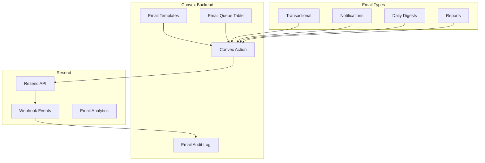

# Email Service Architecture - Resend Integration

**Version:** 1.0  
**Date:** 2025-01-13  
**Author:** Winston (System Architect)  
**Status:** Active

---

## Executive Summary

Caddy uses Resend as the primary email service provider for all transactional emails, notifications, and communications. Resend is integrated via Convex actions, providing reliable email delivery with comprehensive tracking, templates, and compliance features.

---

## Why Resend?

### Key Benefits
- **Developer Experience:** Simple API, excellent documentation
- **React Email Support:** Write emails in React/JSX
- **Deliverability:** Built on AWS SES with excellent reputation
- **Real-time Webhooks:** Track opens, clicks, bounces
- **Australian Compliance:** Data residency options available
- **Cost Effective:** 3,000 emails free/month, then $20 for 50k
- **Domain Management:** Easy DKIM, SPF, DMARC setup

---

## Integration Architecture



---

## Email Categories & Templates

### 1. Authentication Emails
```typescript
// convex/emails/auth.ts
export const sendWelcomeEmail = action({
  args: {
    userId: v.id("users"),
    organizationName: v.string(),
  },
  handler: async (ctx, args) => {
    const user = await ctx.runQuery(api.users.get, { id: args.userId });
    
    const { data, error } = await resend.emails.send({
      from: 'Caddy <welcome@notifications.caddy.team>',
      to: [user.profile.email],
      subject: `Welcome to Caddy, ${user.profile.firstName}!`,
      react: WelcomeEmail({
        firstName: user.profile.firstName,
        organizationName: args.organizationName,
        loginUrl: `${process.env.APP_URL}/auth/login`,
      }),
      tags: [
        { name: 'category', value: 'authentication' },
        { name: 'user_id', value: args.userId },
      ],
    });
    
    // Log email send
    await ctx.runMutation(api.emailLogs.create, {
      userId: args.userId,
      type: 'welcome',
      resendId: data?.id,
      status: error ? 'failed' : 'sent',
      error: error?.message,
    });
    
    return { success: !error, id: data?.id };
  },
});
```

### 2. Notification Emails
```typescript
// convex/emails/notifications.ts
export const sendBudgetAlert = action({
  args: {
    participantId: v.id("participants"),
    budgetId: v.id("budgets"),
    alertType: v.union(v.literal("warning"), v.literal("critical")),
    percentUsed: v.number(),
  },
  handler: async (ctx, args) => {
    const [participant, budget, coordinators] = await Promise.all([
      ctx.runQuery(api.participants.get, { id: args.participantId }),
      ctx.runQuery(api.budgets.get, { id: args.budgetId }),
      ctx.runQuery(api.users.getCoordinators, { 
        organizationId: participant.organizationId 
      }),
    ]);
    
    // Send to all coordinators
    const emails = coordinators
      .filter(c => c.preferences.notifications.email)
      .map(coordinator => ({
        from: 'Caddy Alerts <alerts@notifications.caddy.team>',
        to: coordinator.profile.email,
        subject: `${args.alertType === 'critical' ? '🚨 Critical' : '⚠️ Warning'}: Budget Alert for ${participant.profile.firstName} ${participant.profile.lastName}`,
        react: BudgetAlertEmail({
          coordinatorName: coordinator.profile.firstName,
          participant,
          budget,
          percentUsed: args.percentUsed,
          remainingAmount: budget.remaining,
          daysRemaining: calculateDaysRemaining(budget.endDate),
          viewUrl: `${process.env.APP_URL}/participants/${args.participantId}/budgets`,
        }),
        tags: [
          { name: 'category', value: 'budget_alert' },
          { name: 'alert_type', value: args.alertType },
          { name: 'participant_id', value: args.participantId },
        ],
      }));
    
    const results = await resend.batch.send(emails);
    
    // Log all sends
    await Promise.all(
      results.data.map((result, index) =>
        ctx.runMutation(api.emailLogs.create, {
          userId: coordinators[index]._id,
          type: 'budget_alert',
          resendId: result.id,
          status: 'sent',
          metadata: {
            participantId: args.participantId,
            alertType: args.alertType,
            percentUsed: args.percentUsed,
          },
        })
      )
    );
    
    return { sent: results.data.length };
  },
});
```

### 3. Daily Digest Emails
```typescript
// convex/emails/digests.ts
export const sendDailyDigest = action({
  args: {
    organizationId: v.id("organizations"),
  },
  handler: async (ctx, args) => {
    const yesterday = new Date();
    yesterday.setDate(yesterday.getDate() - 1);
    
    // Gather digest data
    const [organization, stats, alerts, upcomingTasks] = await Promise.all([
      ctx.runQuery(api.organizations.get, { id: args.organizationId }),
      ctx.runQuery(api.dashboard.getDailyStats, { 
        organizationId: args.organizationId,
        date: yesterday.toISOString(),
      }),
      ctx.runQuery(api.alerts.getUnresolved, { 
        organizationId: args.organizationId 
      }),
      ctx.runQuery(api.tasks.getUpcoming, { 
        organizationId: args.organizationId,
        days: 7,
      }),
    ]);
    
    // Get users who want daily digests
    const users = await ctx.runQuery(api.users.getByOrganization, {
      organizationId: args.organizationId,
      withDigestEnabled: true,
    });
    
    if (users.length === 0) return { sent: 0 };
    
    // Create personalized digests
    const emails = users.map(user => ({
      from: 'Caddy Daily <daily@notifications.caddy.team>',
      to: user.profile.email,
      subject: `📊 Your Daily Caddy Report - ${formatDate(yesterday)}`,
      react: DailyDigestEmail({
        userName: user.profile.firstName,
        organization: organization.name,
        date: yesterday,
        stats: {
          servicesDelivered: stats.servicesDelivered,
          hoursProvided: stats.totalHours,
          participantsServed: stats.uniqueParticipants,
          claimsGenerated: stats.claimsValue,
        },
        alerts: alerts.slice(0, 5),
        upcomingTasks: upcomingTasks.filter(t => 
          t.assignedTo === user._id || t.assignedTo === null
        ).slice(0, 5),
        dashboardUrl: `${process.env.APP_URL}/dashboard`,
      }),
      scheduledFor: getTomorrowMorning(user.preferences.timezone),
      tags: [
        { name: 'category', value: 'daily_digest' },
        { name: 'organization_id', value: args.organizationId },
      ],
    }));
    
    const results = await resend.batch.send(emails);
    
    return { sent: results.data.length };
  },
});
```

### 4. Compliance & Report Emails
```typescript
// convex/emails/compliance.ts
export const sendComplianceReport = action({
  args: {
    organizationId: v.id("organizations"),
    reportType: v.union(
      v.literal("monthly_compliance"),
      v.literal("audit_preparation"),
      v.literal("incident_summary")
    ),
    reportData: v.any(),
  },
  handler: async (ctx, args) => {
    const [organization, admins] = await Promise.all([
      ctx.runQuery(api.organizations.get, { id: args.organizationId }),
      ctx.runQuery(api.users.getAdmins, { 
        organizationId: args.organizationId 
      }),
    ]);
    
    // Generate PDF report
    const reportPdf = await generateComplianceReport(args.reportData);
    
    const emails = admins.map(admin => ({
      from: 'Caddy Compliance <compliance@notifications.caddy.team>',
      to: admin.profile.email,
      subject: `${getReportTitle(args.reportType)} - ${organization.name}`,
      react: ComplianceReportEmail({
        adminName: admin.profile.firstName,
        organization: organization.name,
        reportType: args.reportType,
        summary: args.reportData.summary,
        keyMetrics: args.reportData.metrics,
        recommendations: args.reportData.recommendations,
      }),
      attachments: [
        {
          filename: `${args.reportType}_${Date.now()}.pdf`,
          content: reportPdf,
        },
      ],
      tags: [
        { name: 'category', value: 'compliance' },
        { name: 'report_type', value: args.reportType },
      ],
    }));
    
    const results = await resend.batch.send(emails);
    
    return { sent: results.data.length };
  },
});
```

---

## React Email Templates

### Template Structure
```tsx
// emails/templates/BudgetAlert.tsx
import {
  Body,
  Button,
  Container,
  Head,
  Heading,
  Html,
  Img,
  Link,
  Preview,
  Section,
  Text,
} from '@react-email/components';

interface BudgetAlertEmailProps {
  coordinatorName: string;
  participant: {
    firstName: string;
    lastName: string;
    ndisNumber: string;
  };
  budget: {
    category: string;
    allocated: number;
    remaining: number;
  };
  percentUsed: number;
  daysRemaining: number;
  viewUrl: string;
}

export const BudgetAlertEmail = ({
  coordinatorName,
  participant,
  budget,
  percentUsed,
  daysRemaining,
  viewUrl,
}: BudgetAlertEmailProps) => {
  const previewText = `Budget alert for ${participant.firstName} - ${percentUsed.toFixed(0)}% used`;
  
  return (
    <Html>
      <Head />
      <Preview>{previewText}</Preview>
      <Body style={main}>
        <Container style={container}>
          
          
          <Heading style={h1}>Budget Alert</Heading>
          
          <Text style={text}>Hi {coordinatorName},</Text>
          
          <Section style={alertBox}>
            <Text style={alertText}>
              <strong>{participant.firstName} {participant.lastName}</strong> 
              (NDIS: {participant.ndisNumber}) has used{' '}
              <strong>{percentUsed.toFixed(0)}%</strong> of their{' '}
              <strong>{budget.category}</strong> budget.
            </Text>
            
            <div style={statsContainer}>
              <div style={stat}>
                <Text style={statLabel}>Remaining Budget</Text>
                <Text style={statValue}>${budget.remaining.toLocaleString()}</Text>
              </div>
              <div style={stat}>
                <Text style={statLabel}>Days Remaining</Text>
                <Text style={statValue}>{daysRemaining}</Text>
              </div>
            </div>
          </Section>
          
          <Section style={buttonContainer}>
            <Button style={button} href={viewUrl}>
              View Budget Details
            </Button>
          </Section>
          
          <Text style={footer}>
            This is an automated alert from Caddy. 
            <Link href="https://caddy.team/settings/notifications">
              Manage your notification preferences
            </Link>
          </Text>
        </Container>
      </Body>
    </Html>
  );
};

// Styles
const main = {
  backgroundColor: '#f6f9fc',
  fontFamily: '-apple-system,BlinkMacSystemFont,"Segoe UI",Roboto,"Helvetica Neue",Ubuntu,sans-serif',
};

const container = {
  backgroundColor: '#ffffff',
  margin: '0 auto',
  padding: '20px 0 48px',
  marginBottom: '64px',
};

const alertBox = {
  backgroundColor: '#fff4e5',
  borderRadius: '8px',
  padding: '24px',
  margin: '24px 20px',
  border: '1px solid #ffb700',
};

// ... more styles
```

---

## Email Queue & Reliability

### Queue Implementation
```typescript
// convex/schema.ts - Email queue table
emailQueue: defineTable({
  organizationId: v.id("organizations"),
  recipientId: v.id("users"),
  type: v.string(),
  priority: v.union(v.literal("high"), v.literal("normal"), v.literal("low")),
  payload: v.any(),
  status: v.union(
    v.literal("pending"),
    v.literal("processing"),
    v.literal("sent"),
    v.literal("failed"),
    v.literal("bounced")
  ),
  attempts: v.number(),
  scheduledFor: v.optional(v.number()),
  sentAt: v.optional(v.number()),
  error: v.optional(v.string()),
  resendId: v.optional(v.string()),
  createdAt: v.number(),
})
  .index("by_status_scheduled", ["status", "scheduledFor"])
  .index("by_recipient", ["recipientId"])
  .index("by_resend", ["resendId"]),

// convex/emails/queue.ts
export const processEmailQueue = internalMutation({
  handler: async (ctx) => {
    const now = Date.now();
    
    // Get pending emails ready to send
    const pending = await ctx.db
      .query("emailQueue")
      .withIndex("by_status_scheduled", (q) =>
        q.eq("status", "pending")
      )
      .filter((q) =>
        q.or(
          q.eq(q.field("scheduledFor"), undefined),
          q.lte(q.field("scheduledFor"), now)
        )
      )
      .take(10); // Batch size
    
    for (const email of pending) {
      // Mark as processing
      await ctx.db.patch(email._id, { 
        status: "processing",
        attempts: email.attempts + 1,
      });
      
      try {
        // Send via appropriate method
        const result = await ctx.scheduler.runAfter(0, 
          api.emails[email.type].send,
          email.payload
        );
        
        // Mark as sent
        await ctx.db.patch(email._id, {
          status: "sent",
          sentAt: now,
          resendId: result.id,
        });
      } catch (error) {
        // Handle failure
        if (email.attempts >= 3) {
          await ctx.db.patch(email._id, {
            status: "failed",
            error: error.message,
          });
        } else {
          // Retry with exponential backoff
          await ctx.db.patch(email._id, {
            status: "pending",
            scheduledFor: now + Math.pow(2, email.attempts) * 60000,
            error: error.message,
          });
        }
      }
    }
  },
});

// Schedule queue processing
crons.interval(
  "process email queue",
  { seconds: 30 },
  api.emails.queue.processEmailQueue
);
```

---

## Webhook Processing

### Resend Webhook Handler
```typescript
// convex/emails/webhooks.ts
export const handleResendWebhook = httpAction(async (ctx, request) => {
  const signature = request.headers.get("svix-signature");
  const timestamp = request.headers.get("svix-timestamp");
  const id = request.headers.get("svix-id");
  
  // Verify webhook signature
  const body = await request.text();
  if (!verifyWebhookSignature(body, signature, timestamp, id)) {
    return new Response("Unauthorized", { status: 401 });
  }
  
  const event = JSON.parse(body);
  
  switch (event.type) {
    case "email.sent":
      await ctx.runMutation(api.emailLogs.updateStatus, {
        resendId: event.data.email_id,
        status: "delivered",
        deliveredAt: Date.now(),
      });
      break;
      
    case "email.opened":
      await ctx.runMutation(api.emailLogs.recordOpen, {
        resendId: event.data.email_id,
        openedAt: Date.now(),
        userAgent: event.data.user_agent,
        ip: event.data.ip,
      });
      break;
      
    case "email.clicked":
      await ctx.runMutation(api.emailLogs.recordClick, {
        resendId: event.data.email_id,
        clickedAt: Date.now(),
        link: event.data.link,
      });
      break;
      
    case "email.bounced":
      await ctx.runMutation(api.emailLogs.handleBounce, {
        resendId: event.data.email_id,
        bounceType: event.data.bounce_type,
        bounceMessage: event.data.bounce_message,
      });
      
      // Update user email status if hard bounce
      if (event.data.bounce_type === "hard") {
        await ctx.runMutation(api.users.markEmailInvalid, {
          email: event.data.to[0],
        });
      }
      break;
      
    case "email.complained":
      await ctx.runMutation(api.emailLogs.handleComplaint, {
        resendId: event.data.email_id,
      });
      
      // Unsubscribe user from marketing emails
      await ctx.runMutation(api.users.unsubscribe, {
        email: event.data.to[0],
        reason: "complaint",
      });
      break;
  }
  
  return new Response("OK", { status: 200 });
});
```

---

## Configuration & Setup

### Environment Variables
```bash
# .env.local
RESEND_API_KEY=re_xxxxxxxxxxxxx
RESEND_WEBHOOK_SECRET=whsec_xxxxxxxxxxxxx
RESEND_FROM_DOMAIN=notifications.caddy.team
APP_URL=https://app.caddy.team
```

### Domain Configuration
```typescript
// DNS Records for caddy.team
// MX Records
// - Priority: 10, Value: feedback-smtp.au-syd-1.amazonses.com

// SPF Record
// TXT: v=spf1 include:amazonses.com ~all

// DKIM Records (provided by Resend)
// resend._domainkey.caddy.team
// TXT: k=rsa; p=MIGfMA0GCSq...

// DMARC Record
// _dmarc.caddy.team
// TXT: v=DMARC1; p=quarantine; rua=mailto:dmarc@caddy.team
```

### Resend SDK Setup
```typescript
// convex/lib/resend.ts
import { Resend } from 'resend';

export const resend = new Resend(process.env.RESEND_API_KEY);

// With retry configuration
export const resendWithRetry = new Resend(process.env.RESEND_API_KEY, {
  retries: 3,
  timeout: 10000,
});
```

---

## Email Analytics & Monitoring

### Tracking Metrics
```typescript
// convex/emails/analytics.ts
export const getEmailMetrics = query({
  args: {
    organizationId: v.id("organizations"),
    startDate: v.string(),
    endDate: v.string(),
  },
  handler: async (ctx, args) => {
    const logs = await ctx.db
      .query("emailLogs")
      .withIndex("by_organization_date")
      .filter((q) =>
        q.and(
          q.eq(q.field("organizationId"), args.organizationId),
          q.gte(q.field("createdAt"), new Date(args.startDate).getTime()),
          q.lte(q.field("createdAt"), new Date(args.endDate).getTime())
        )
      )
      .collect();
    
    return {
      sent: logs.length,
      delivered: logs.filter(l => l.status === "delivered").length,
      opened: logs.filter(l => l.openedAt).length,
      clicked: logs.filter(l => l.clicks?.length > 0).length,
      bounced: logs.filter(l => l.status === "bounced").length,
      complained: logs.filter(l => l.status === "complained").length,
      
      byType: Object.entries(
        logs.reduce((acc, log) => {
          acc[log.type] = (acc[log.type] || 0) + 1;
          return acc;
        }, {})
      ),
      
      deliveryRate: (logs.filter(l => l.status === "delivered").length / logs.length) * 100,
      openRate: (logs.filter(l => l.openedAt).length / logs.filter(l => l.status === "delivered").length) * 100,
      clickRate: (logs.filter(l => l.clicks?.length > 0).length / logs.filter(l => l.openedAt).length) * 100,
    };
  },
});
```

### Dashboard Component
```tsx
// components/EmailAnalytics.tsx
export function EmailAnalytics() {
  const metrics = useQuery(api.emails.analytics.getEmailMetrics, {
    organizationId: orgId,
    startDate: startOfMonth(new Date()).toISOString(),
    endDate: endOfMonth(new Date()).toISOString(),
  });
  
  return (
    <Card>
      <CardHeader>
        <CardTitle>Email Performance</CardTitle>
      </CardHeader>
      <CardContent>
        <div className="grid grid-cols-4 gap-4">
          <Stat
            label="Sent"
            value={metrics?.sent || 0}
            icon={SendIcon}
          />
          <Stat
            label="Delivery Rate"
            value={`${metrics?.deliveryRate.toFixed(1)}%`}
            status={metrics?.deliveryRate > 95 ? 'success' : 'warning'}
          />
          <Stat
            label="Open Rate"
            value={`${metrics?.openRate.toFixed(1)}%`}
            status={metrics?.openRate > 25 ? 'success' : 'warning'}
          />
          <Stat
            label="Click Rate"
            value={`${metrics?.clickRate.toFixed(1)}%`}
            status={metrics?.clickRate > 5 ? 'success' : 'warning'}
          />
        </div>
      </CardContent>
    </Card>
  );
}
```

---

## Cost Analysis

### Resend Pricing
```yaml
Free Tier:
  - 3,000 emails/month
  - 100 emails/day
  - Perfect for development

Pro ($20/month):
  - 50,000 emails/month
  - Suitable for 50-100 organizations

Scale (Usage-based):
  - $0.00035 per email after 50k
  - Volume discounts available

Estimated Monthly Costs:
  Development: $0
  50 orgs (15k emails): $20
  500 orgs (150k emails): $55
  2000 orgs (600k emails): $212
```

---

## Compliance & Best Practices

### CAN-SPAM & Privacy Act Compliance
- Unsubscribe links in all marketing emails
- Physical address in footer
- Clear sender identification
- Honor unsubscribe within 10 days
- No misleading subject lines

### Email Preferences Management
```typescript
// User preferences schema
preferences: v.object({
  notifications: v.object({
    email: v.boolean(),
    digest: v.boolean(),
    budgetAlerts: v.boolean(),
    complianceReports: v.boolean(),
    marketing: v.boolean(),
  }),
  digestFrequency: v.union(
    v.literal("daily"),
    v.literal("weekly"),
    v.literal("never")
  ),
  timezone: v.string(),
})
```

### Rate Limiting
- Max 100 emails per recipient per day
- Batch similar notifications
- Implement digest emails for high-volume alerts
- Respect user quiet hours

---

## Testing Strategy

### Email Testing
```typescript
// convex/emails/test.ts
export const testEmail = action({
  args: {
    template: v.string(),
    recipientEmail: v.string(),
    testData: v.any(),
  },
  handler: async (ctx, args) => {
    // Only allow in development
    if (process.env.NODE_ENV === "production") {
      throw new Error("Test emails not allowed in production");
    }
    
    const { data, error } = await resend.emails.send({
      from: 'Test <test@notifications.caddy.team>',
      to: [args.recipientEmail],
      subject: `[TEST] ${args.template} Template`,
      react: getTemplate(args.template, args.testData),
      tags: [{ name: 'test', value: 'true' }],
    });
    
    return { success: !error, id: data?.id };
  },
});
```

---

**This email architecture provides a robust, scalable foundation for all Caddy's communication needs while maintaining compliance and excellent deliverability.**