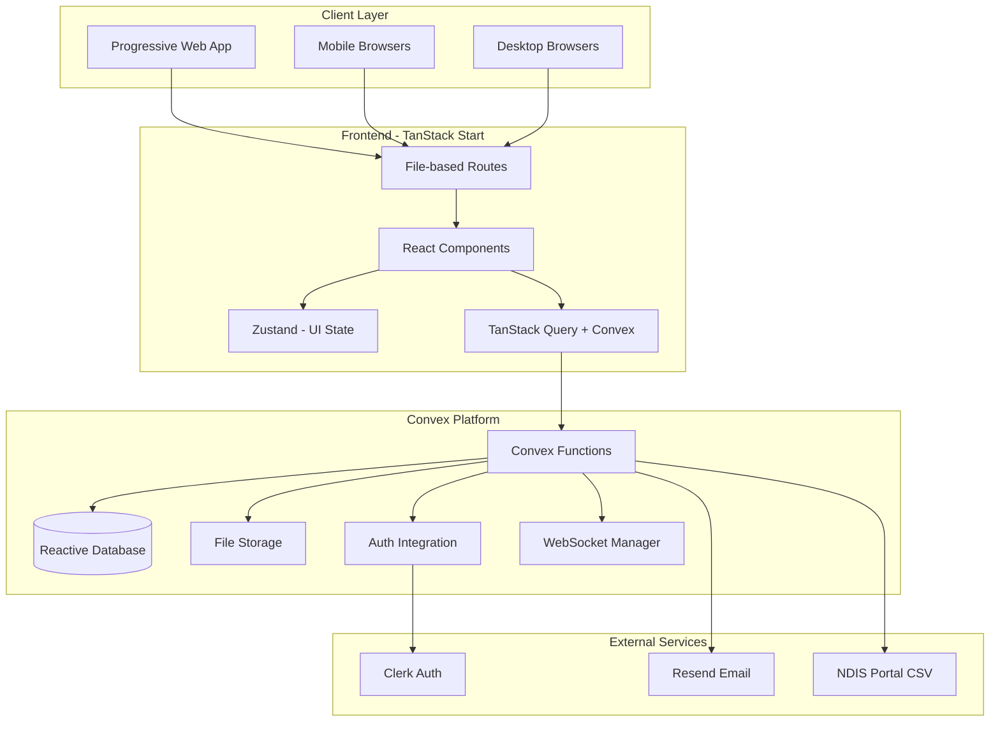
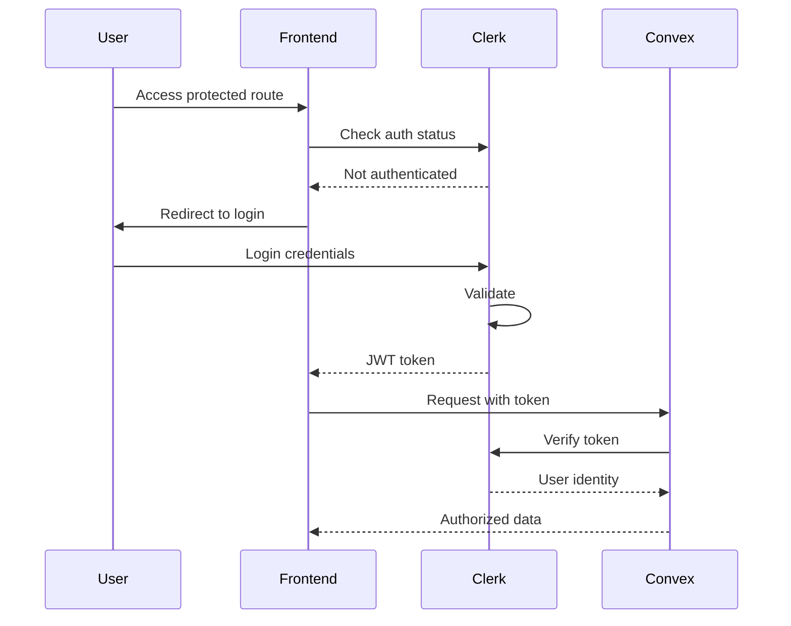
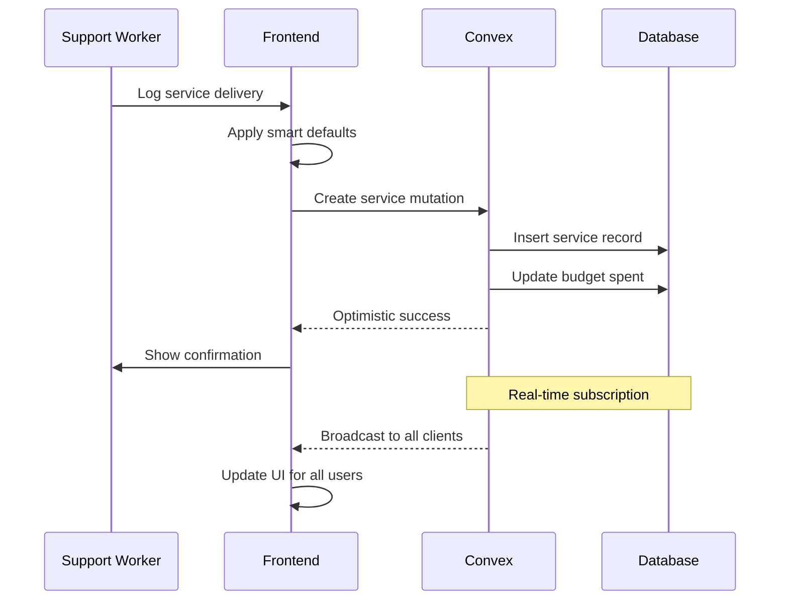
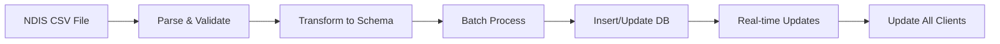

# Full-Stack Architecture - Caddy Platform

**Version:** 2.0  
**Date:** 2025-01-13  
**Author:** Winston (System Architect)  
**Status:** Active

---

## Executive Summary

This document defines the complete full-stack architecture for Caddy, an NDIS service provider management platform. The architecture leverages TanStack Start for the frontend and Convex as a complete backend platform, enabling real-time collaboration, offline-first capabilities, and zero DevOps overhead.

### Key Architectural Decisions
- **Frontend:** TanStack Start with file-based routing
- **Backend:** Convex reactive platform (no separate backend needed)
- **Database:** Convex built-in reactive database
- **Real-time:** Native WebSocket subscriptions via Convex
- **Authentication:** Clerk with Convex integration
- **Hosting:** Vercel/Netlify (frontend) + Convex Cloud (backend)

---

## System Architecture Overview



---

## Frontend Architecture

### Technology Stack
```yaml
Framework: TanStack Start
Language: TypeScript 5.x
Styling: Tailwind CSS 3.x
Components: Shadcn/ui + Radix UI
Build Tool: Vite
Testing: Vitest + Playwright
```

### Project Structure
```
src/
├── routes/                 # TanStack Start routes
│   ├── __root.tsx         # Root layout with providers
│   ├── index.tsx          # Daily Huddle Dashboard
│   ├── auth/
│   │   ├── login.tsx
│   │   └── register.tsx
│   ├── participants/
│   │   ├── index.tsx      # List view
│   │   ├── $id.tsx        # Detail view
│   │   └── new.tsx        # Create form
│   ├── services/
│   │   ├── index.tsx
│   │   ├── new.tsx
│   │   └── $id/edit.tsx
│   ├── claims/
│   │   ├── index.tsx
│   │   └── generate.tsx
│   └── team/
│       └── index.tsx
├── components/
│   ├── ui/                # Shadcn components
│   ├── features/          # Feature-specific
│   │   ├── participants/
│   │   ├── services/
│   │   ├── budgets/
│   │   └── claims/
│   └── layouts/
│       ├── DashboardLayout.tsx
│       └── AuthLayout.tsx
├── convex/                # Backend functions
│   ├── _generated/        # Auto-generated
│   ├── schema.ts         # Database schema
│   ├── auth.config.ts    # Clerk config
│   ├── participants.ts   # Participant functions
│   ├── services.ts       # Service functions
│   ├── budgets.ts        # Budget tracking
│   ├── claims.ts         # Claims processing
│   └── imports.ts        # CSV import logic
├── lib/
│   ├── hooks/            # Custom React hooks
│   ├── utils/            # Utility functions
│   └── validators/       # Zod schemas
├── stores/               # Zustand stores
│   └── ui.store.ts      # UI-only state
└── styles/
    └── globals.css      # Global styles
```

### Routing Strategy
```typescript
// TanStack Start file-based routing
// routes/participants/$id.tsx
import { createFileRoute } from '@tanstack/react-router'
import { api } from '@/convex/_generated/api'

export const Route = createFileRoute('/participants/$id')({
  loader: async ({ params, context }) => {
    // Pre-load data for SSR
    const participant = await context.convex.query(
      api.participants.get,
      { id: params.id }
    )
    return { participant }
  },
  component: ParticipantDetail,
})
```

### State Management

#### Server State (Convex)
```typescript
// Real-time subscriptions
const participants = useQuery(api.participants.list, {
  organizationId: org.id,
  status: 'active'
})

// Optimistic mutations
const updateParticipant = useMutation(api.participants.update)
  .withOptimisticUpdate((store, args) => {
    // Update local cache immediately
  })
```

#### UI State (Zustand)
```typescript
interface UIStore {
  // UI-only state
  sidebarOpen: boolean
  selectedFilters: FilterState
  viewMode: 'grid' | 'list'
  theme: 'light' | 'dark'
  
  // Actions
  toggleSidebar: () => void
  setFilters: (filters: FilterState) => void
}
```

---

## Backend Architecture (Convex)

### Convex Schema Design
```typescript
// convex/schema.ts
export default defineSchema({
  organizations: defineTable({
    name: v.string(),
    abn: v.optional(v.string()),
    settings: v.object({
      timezone: v.string(),
      currency: v.string(),
      ndisRegistration: v.optional(v.string()),
    }),
    subscription: v.object({
      plan: v.union(v.literal("free"), v.literal("pro")),
      status: v.string(),
      validUntil: v.number(),
    }),
  }).index("by_abn", ["abn"]),

  participants: defineTable({
    organizationId: v.id("organizations"),
    ndisNumber: v.string(),
    profile: v.object({
      firstName: v.string(),
      lastName: v.string(),
      dateOfBirth: v.string(),
      email: v.optional(v.string()),
    }),
    plan: v.object({
      startDate: v.string(),
      endDate: v.string(),
      totalBudget: v.number(),
    }),
    status: v.union(
      v.literal("active"),
      v.literal("inactive"),
      v.literal("archived")
    ),
  })
    .index("by_org", ["organizationId"])
    .index("by_ndis", ["ndisNumber"])
    .searchIndex("search", {
      searchField: "profile",
      filterFields: ["organizationId", "status"],
    }),

  services: defineTable({
    organizationId: v.id("organizations"),
    participantId: v.id("participants"),
    budgetId: v.id("budgets"),
    supportWorkerId: v.id("users"),
    serviceDate: v.string(),
    startTime: v.string(),
    endTime: v.string(),
    duration: v.number(),
    supportItem: v.object({
      code: v.string(),
      description: v.string(),
      rate: v.number(),
    }),
    notes: v.string(),
    status: v.union(
      v.literal("scheduled"),
      v.literal("completed"),
      v.literal("cancelled"),
      v.literal("billed")
    ),
  })
    .index("by_org_date", ["organizationId", "serviceDate"])
    .index("by_participant", ["participantId"]),
})
```

### Function Types

#### Queries (Real-time Subscriptions)
```typescript
// convex/participants.ts
export const list = query({
  args: {
    organizationId: v.id("organizations"),
    search: v.optional(v.string()),
  },
  handler: async (ctx, args) => {
    // Automatically creates real-time subscription
    return await ctx.db
      .query("participants")
      .withIndex("by_org", q => 
        q.eq("organizationId", args.organizationId)
      )
      .filter(q => 
        args.search 
          ? q.or(
              q.contains(q.field("profile.firstName"), args.search),
              q.contains(q.field("profile.lastName"), args.search)
            )
          : true
      )
      .collect()
  },
})
```

#### Mutations (Write Operations)
```typescript
export const create = mutation({
  args: {
    ndisNumber: v.string(),
    profile: v.object({...}),
    plan: v.object({...}),
  },
  handler: async (ctx, args) => {
    const identity = await ctx.auth.getUserIdentity()
    if (!identity) throw new Error("Unauthorized")
    
    // ACID transaction
    const id = await ctx.db.insert("participants", {
      ...args,
      organizationId: identity.organizationId,
      createdAt: Date.now(),
    })
    
    // Create initial budgets
    await createDefaultBudgets(ctx, id, args.plan)
    
    return id
  },
})
```

#### Actions (External Integrations)
```typescript
export const importFromCSV = action({
  args: {
    csvData: v.string(),
    organizationId: v.id("organizations"),
  },
  handler: async (ctx, args) => {
    const rows = parseCSV(args.csvData)
    const results = []
    
    for (const row of rows) {
      try {
        const participant = transformNDISData(row)
        const id = await ctx.runMutation(
          api.participants.createOrUpdate,
          participant
        )
        results.push({ success: true, id })
      } catch (error) {
        results.push({ 
          success: false, 
          ndisNumber: row["NDIS Number"],
          error: error.message 
        })
      }
    }
    
    return results
  },
})
```

---

## Real-time Features

### WebSocket Management
```typescript
// Automatic with Convex - no manual setup needed
const convex = new ConvexReactClient(CONVEX_URL, {
  // Automatic reconnection
  // Multiplexed subscriptions
  // Offline queue for mutations
})
```

### Optimistic Updates
```typescript
const updateService = useMutation(api.services.update)
  .withOptimisticUpdate((localStore, { id, updates }) => {
    const current = localStore.getQuery(
      api.services.get, 
      { id }
    )
    if (current) {
      localStore.setQuery(
        api.services.get,
        { id },
        { ...current, ...updates }
      )
    }
  })
```

### Presence & Collaboration
```typescript
// Track active users
export const trackPresence = mutation({
  args: {
    participantId: v.id("participants"),
    isViewing: v.boolean(),
  },
  handler: async (ctx, args) => {
    const identity = await ctx.auth.getUserIdentity()
    
    await ctx.db.patch(identity.userId, {
      currentView: args.isViewing ? args.participantId : null,
      lastActive: Date.now(),
    })
  },
})
```

---

## Security Architecture

### Authentication Flow


### Security Layers
1. **Authentication:** Clerk with MFA support
2. **Authorization:** Row-level security in Convex
3. **Data Encryption:** At rest and in transit (Convex)
4. **API Security:** Rate limiting, CORS (Convex)
5. **Input Validation:** Zod schemas + Convex validators
6. **Audit Logging:** Automatic with every mutation

### RBAC Implementation
```typescript
// convex/auth.ts
export const requireRole = (
  ctx: QueryCtx | MutationCtx,
  roles: Role[]
) => {
  const identity = await ctx.auth.getUserIdentity()
  if (!identity) throw new Error("Unauthorized")
  
  const user = await ctx.db
    .query("users")
    .withIndex("by_clerk", q => 
      q.eq("clerkId", identity.subject)
    )
    .unique()
  
  if (!user || !roles.includes(user.role)) {
    throw new Error("Insufficient permissions")
  }
  
  return user
}
```

---

## Performance Strategy

### Frontend Optimization
- **Code Splitting:** Automatic per-route with TanStack Start
- **Lazy Loading:** Components loaded on demand
- **Virtual Scrolling:** TanStack Virtual for large lists
- **Image Optimization:** Convex CDN with automatic resizing
- **PWA:** Service worker for offline static assets

### Backend Optimization
- **Edge Computing:** Convex global distribution
- **Query Optimization:** Automatic indexes
- **Caching:** Built-in reactive caching
- **Connection Pooling:** Managed by Convex
- **Rate Limiting:** Automatic DDoS protection

### Metrics & Monitoring
```yaml
Performance Targets:
  - First Contentful Paint: < 1.5s
  - Time to Interactive: < 3.5s
  - API Response Time: < 200ms (p95)
  - Real-time Latency: < 100ms
  - Offline Sync Time: < 5s
```

---

## Infrastructure & Deployment

### Environments
```yaml
Development:
  Frontend: localhost:5173 (Vite dev server)
  Backend: Convex dev deployment
  Auth: Clerk dev instance
  
Staging:
  Frontend: caddy-staging.vercel.app
  Backend: Convex preview deployment
  Auth: Clerk staging
  
Production:
  Frontend: caddy.team
  Backend: Convex production
  Auth: Clerk production
  CDN: CloudFlare
```

### CI/CD Pipeline
```yaml
name: Deploy
on:
  push:
    branches: [main]

jobs:
  test:
    - Run TypeScript checks
    - Run Vitest unit tests
    - Run Playwright E2E tests
    
  deploy-convex:
    - npx convex deploy --prod
    
  deploy-frontend:
    - Build with Vite
    - Deploy to Vercel/Netlify
```

### Monitoring Stack
- **Application:** Sentry for error tracking
- **Analytics:** PostHog for product analytics
- **Performance:** Vercel Analytics
- **Backend:** Convex dashboard (built-in)
- **Uptime:** BetterUptime for monitoring

---

## Data Flow Examples

### Service Delivery Flow


### CSV Import Flow


---

## Scalability Considerations

### Horizontal Scaling
- **Frontend:** Static files via CDN (infinite scale)
- **Backend:** Convex automatic scaling
- **Database:** Convex handles sharding
- **WebSockets:** Convex manages connections

### Data Growth Strategy
```yaml
Projected Scale:
  Year 1: 50 organizations, 5K participants
  Year 2: 500 organizations, 50K participants
  Year 3: 2K organizations, 200K participants

Convex Handles:
  - Automatic indexing
  - Query optimization
  - Data partitioning
  - Global replication
```

---

## Migration & Backwards Compatibility

### Data Migration
```typescript
// convex/migrations/v1_to_v2.ts
export const migrateParticipants = action({
  handler: async (ctx) => {
    const participants = await ctx.runQuery(
      api.participants.listAll
    )
    
    for (const p of participants) {
      if (!p.version || p.version < 2) {
        await ctx.runMutation(
          api.participants.migrate,
          { id: p._id, version: 2 }
        )
      }
    }
  },
})
```

### API Versioning
- Convex functions are versioned by deployment
- Old clients continue working with cached functions
- Gradual migration via feature flags

---

## Development Guidelines

### Code Standards
```typescript
// Use consistent patterns
// ✅ Good: Collocated, typed, reactive
export const updateParticipant = mutation({
  args: { 
    id: v.id("participants"),
    updates: v.object({...}) 
  },
  handler: async (ctx, args) => {
    await requireRole(ctx, ["admin", "coordinator"])
    return await ctx.db.patch(args.id, args.updates)
  },
})

// ❌ Bad: Scattered, untyped, imperative
async function updateParticipant(id, data) {
  // Check auth somewhere else
  // Manual type checking
  // Direct DB access
}
```

### Testing Strategy
```yaml
Unit Tests:
  - Components with React Testing Library
  - Convex functions with convex-test
  - Coverage target: 80%

Integration Tests:
  - API endpoints with Convex test client
  - User flows with Playwright

E2E Tests:
  - Critical paths (login, service log, claim)
  - Run against staging environment
```

---

## Cost Analysis

### Infrastructure Costs (Monthly)
```yaml
Development (Free Tier):
  Convex: $0 (free tier)
  Vercel: $0 (hobby)
  Clerk: $0 (up to 5K MAU)
  Resend: $0 (3K emails/month)
  Total: $0

Production (50 orgs):
  Convex: $25 (pro tier)
  Vercel: $20 (pro)
  Clerk: $25 (10K MAU)
  Resend: $20 (50K emails/month)
  CloudFlare: $20 (pro)
  Monitoring: $50
  Total: ~$160/month

Scale (500 orgs):
  Convex: $250 (usage-based)
  Vercel: $20 (pro)
  Clerk: $250 (100K MAU)
  Resend: $55 (150K emails/month)
  CloudFlare: $20 (pro)
  Monitoring: $200
  Total: ~$795/month
```

---

## Risk Mitigation

### Technical Risks
| Risk | Impact | Mitigation |
|------|--------|------------|
| Convex outage | High | Offline mode, status page |
| Data loss | Critical | Automated backups, audit logs |
| Security breach | Critical | MFA, encryption, monitoring |
| Performance degradation | Medium | Monitoring, auto-scaling |

### Business Continuity
- Export functionality for all data
- Documented migration paths
- No vendor lock-in for frontend
- Regular disaster recovery tests

---

## Appendices

### A. Technology Decision Matrix
| Criteria | TanStack Start | Next.js 14 | Score |
|----------|---------------|------------|-------|
| Convex Integration | Excellent | Good | TS |
| Type Safety | Excellent | Good | TS |
| Bundle Size | Better | Good | TS |
| Learning Curve | Simple | Complex | TS |

### B. Compliance Mapping
- NDIS Quality Standards → Audit logs
- Privacy Act → Encryption, access controls
- Healthcare Identifiers → Secure storage
- Data retention → Automated archival

### C. References
- [TanStack Start Docs](https://tanstack.com/start)
- [Convex Documentation](https://docs.convex.dev)
- [NDIS Technical Specifications](https://www.ndis.gov.au)
- [Australian Privacy Principles](https://www.oaic.gov.au)

---

**Document Control:**
- Next Review: 2025-02-13
- Owner: Engineering Team
- Distribution: All developers, DevOps, Product

*This architecture is designed to evolve. Regular reviews ensure alignment with business needs and technical capabilities.*