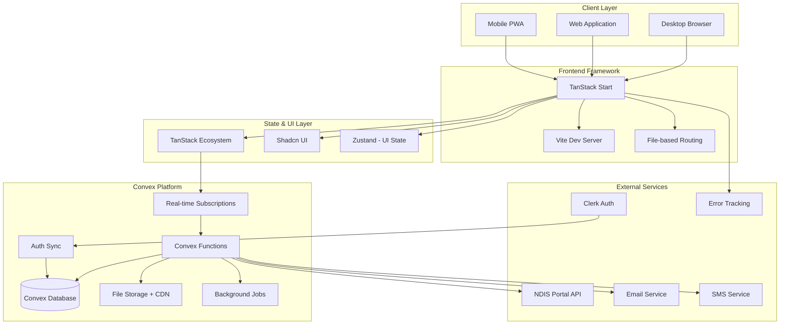
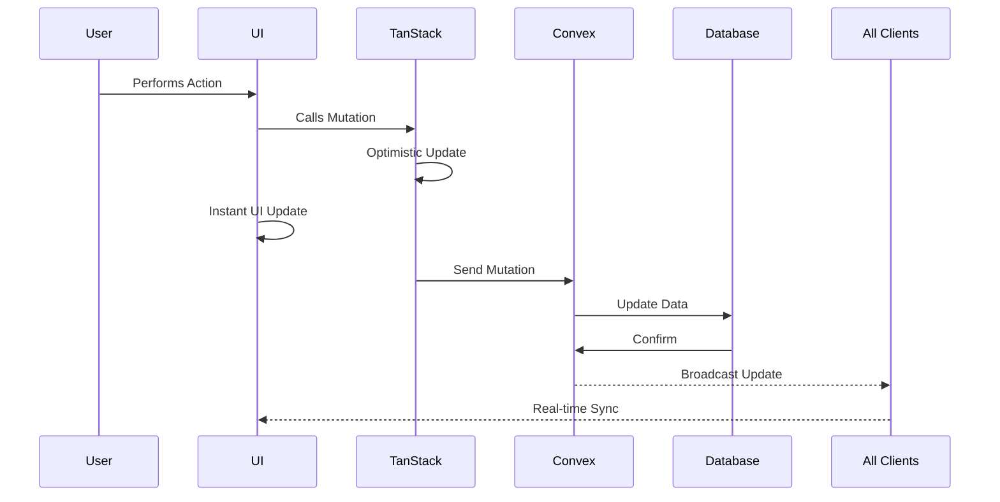
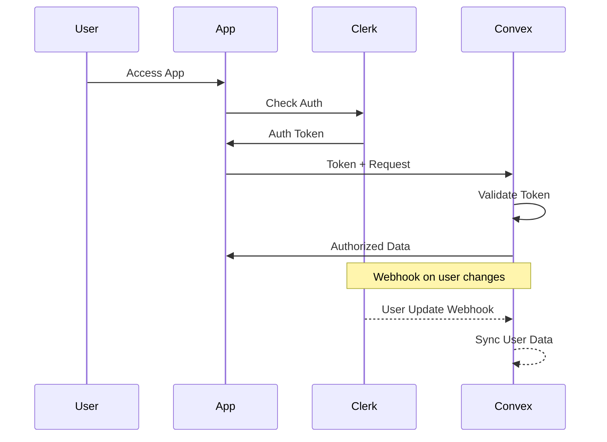
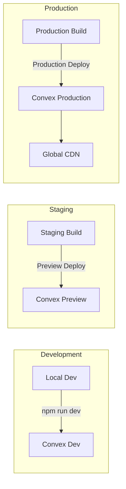

# System Overview

## High-Level Architecture

## Architecture Layers

### 1. Client Layer
- **Progressive Web App (PWA)**: Installable on mobile devices
- **Web Application**: Full-featured desktop experience
- **Offline Support**: Convex sync when reconnected
- **Real-time Updates**: Automatic UI updates via subscriptions

### 2. Frontend Framework (TanStack Start)
- **Vite**: Lightning-fast development and build
- **File-based Routing**: Type-safe routes with parameters
- **Code Splitting**: Automatic per-route splitting
- **TypeScript**: End-to-end type safety

### 3. State Management
- **Server State**: Convex real-time subscriptions (no manual cache)
- **UI State**: Zustand for local UI state only
- **Form State**: TanStack Form with validation
- **Table State**: TanStack Table with virtual scrolling

### 4. Convex Platform (Complete Backend)
- **Database**: ACID-compliant, real-time reactive database
- **Functions**: Type-safe backend functions with TypeScript
- **Real-time**: Automatic subscriptions and updates
- **File Storage**: Built-in CDN for documents and images
- **Background Jobs**: Scheduled and delayed execution
- **Offline Sync**: Automatic conflict resolution

### 5. External Integrations
- **Clerk**: Authentication and user management
- **NDIS Portal**: Claims submission (future)
- **Communications**: Email and SMS notifications
- **Monitoring**: Error tracking and analytics

## Data Flow

### Real-time Data Flow

### Authentication Flow

## Component Responsibilities

| Component | Responsibility | Technology |
|-----------|---------------|------------|
| Client | User interface, offline support | TanStack Start, React, PWA |
| Routing | Type-safe navigation | TanStack Router (file-based) |
| UI Components | Consistent design system | Shadcn UI, Tailwind CSS |
| State (Server) | Real-time data, subscriptions | Convex Queries & Mutations |
| State (UI) | Local UI state only | Zustand |
| Forms | Form handling & validation | TanStack Form, Zod |
| Tables | Data display & virtual scroll | TanStack Table & Virtual |
| Backend | All server logic & data | Convex Functions |
| Database | Data persistence | Convex Database |
| Files | Document & image storage | Convex File Storage |
| Auth | User authentication | Clerk + Convex Integration |
| Monitoring | Error & performance tracking | Sentry, Convex Dashboard |

## Key Architectural Decisions

### Why TanStack Start + Convex?

1. **Real-time First**: Every data fetch is a live subscription
2. **No Backend Infrastructure**: Convex handles everything
3. **Type Safety**: End-to-end TypeScript from database to UI
4. **Offline Support**: Built-in sync and conflict resolution
5. **Zero DevOps**: No servers, databases, or queues to manage
6. **Instant Deployments**: Push to deploy in seconds
7. **Cost Effective**: Pay only for what you use

### Architectural Principles

1. **Simplicity**: Minimize moving parts and complexity
2. **Real-time**: All data updates instantly across all clients
3. **Type Safety**: Catch errors at compile time
4. **Performance**: Virtual scrolling, code splitting, optimistic updates
5. **Offline First**: Work anywhere, sync when connected
6. **Security**: Row-level security, encrypted at rest
7. **Scalability**: Automatic scaling with Convex

## Deployment Architecture

## Security Architecture

### Authentication & Authorization
- **Clerk**: Handle authentication flows
- **Convex**: Row-level security based on user roles
- **JWT**: Secure token validation
- **Webhooks**: Real-time user sync

### Data Security
- **Encryption**: At rest and in transit
- **Access Control**: Function-level authorization
- **Audit Logs**: Complete activity tracking
- **NDIS Compliance**: Meeting all requirements

### Application Security
- **CSP Headers**: Content Security Policy
- **Rate Limiting**: API protection
- **Input Validation**: Zod schemas
- **XSS Protection**: React's built-in protection

## Performance Targets

| Metric | Target | Method |
|--------|--------|--------|
| Initial Load | < 2s | Code splitting, CDN |
| Time to Interactive | < 3s | Lazy loading |
| Lighthouse Score | > 90 | Optimization |
| Real-time Latency | < 100ms | Convex subscriptions |
| Offline Sync | < 5s | Background sync |
| Bundle Size | < 500KB | Tree shaking |

## Monitoring & Observability

### Application Monitoring
- **Error Tracking**: Sentry integration
- **Performance**: Core Web Vitals
- **User Analytics**: Privacy-focused metrics
- **Uptime**: 99.9% SLA target

### Convex Dashboard
- **Function Metrics**: Execution time and count
- **Database Metrics**: Query performance
- **File Storage**: Usage and bandwidth
- **Real-time Connections**: Active subscriptions

## Scalability

### Automatic Scaling with Convex
- **Database**: Scales automatically
- **Functions**: Serverless execution
- **File Storage**: CDN distribution
- **Real-time**: WebSocket management
- **Geographic**: Global edge deployment

### Growth Projections
- **Phase 1**: 10-50 organizations
- **Phase 2**: 50-200 organizations  
- **Phase 3**: 200-1000 organizations
- **Phase 4**: 1000+ organizations

All scaling handled automatically by Convex platform without configuration changes.

---