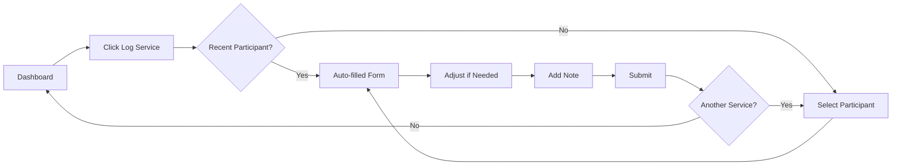
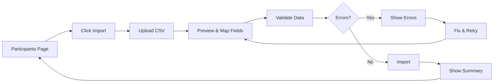
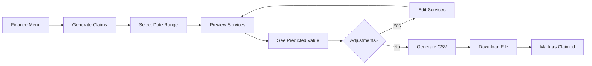

# User Flows

## Flow 1: Quick Service Logging

```mermaid
graph LR
    A[Dashboard] --> B[Click Log Service]
    B --> C{Recent Participant?}
    C -->|Yes| D[Auto-filled Form]
    C -->|No| E[Select Participant]
    E --> D
    D --> F[Adjust if Needed]
    F --> G[Add Note]
    G --> H[Submit]
    H --> I{Another Service?}
    I -->|Yes| E
    I -->|No| A
```

## Flow 2: CSV Import

```mermaid
graph LR
    A[Participants Page] --> B[Click Import]
    B --> C[Upload CSV]
    C --> D[Preview & Map Fields]
    D --> E[Validate Data]
    E --> F{Errors?}
    F -->|Yes| G[Show Errors]
    G --> H[Fix & Retry]
    H --> D
    F -->|No| I[Import]
    I --> J[Show Summary]
    J --> A
```

## Flow 3: Claims Generation

```mermaid
graph LR
    A[Finance Menu] --> B[Generate Claims]
    B --> C[Select Date Range]
    C --> D[Preview Services]
    D --> E[See Predicted Value]
    E --> F{Adjustments?}
    F -->|Yes| G[Edit Services]
    G --> D
    F -->|No| H[Generate CSV]
    H --> I[Download File]
    I --> J[Mark as Claimed]
```

---
