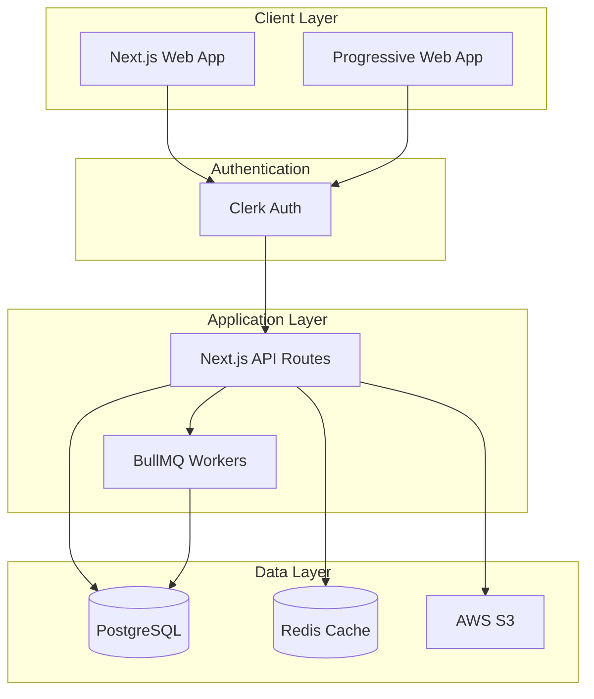

# Technical Architecture

## Technology Stack

### Frontend
- **Framework:** Next.js 14 with App Router
- **Language:** TypeScript
- **Styling:** Tailwind CSS with Shadcn/ui
- **State Management:** Zustand
- **Forms:** React Hook Form with Zod validation
- **Tables:** TanStack Table
- **Charts:** Recharts

### Backend
- **Runtime:** Node.js 20 LTS
- **Framework:** Next.js API Routes
- **ORM:** Prisma 5
- **Database:** PostgreSQL 15
- **Cache:** Redis (Railway)
- **Queue:** BullMQ
- **File Storage:** AWS S3

### Authentication
- **Provider:** Clerk
- **Session Management:** JWT with refresh tokens
- **MFA:** Optional TOTP

### Infrastructure
- **Hosting:** Railway (Production)
- **CDN:** Cloudflare
- **Monitoring:** Sentry
- **Analytics:** PostHog
- **CI/CD:** GitHub Actions

## System Architecture



## Deployment Architecture

```yaml
Production Environment:
  - Railway (Primary hosting)
  - PostgreSQL cluster with read replicas
  - Redis for caching and sessions
  - S3 for document storage
  - CloudFlare for CDN and DDoS protection

Staging Environment:
  - Railway (Separate project)
  - Shared PostgreSQL instance
  - Shared Redis instance
  - S3 bucket (staging)

Development:
  - Local Next.js
  - Docker PostgreSQL
  - Docker Redis
  - LocalStack for S3
```

---
